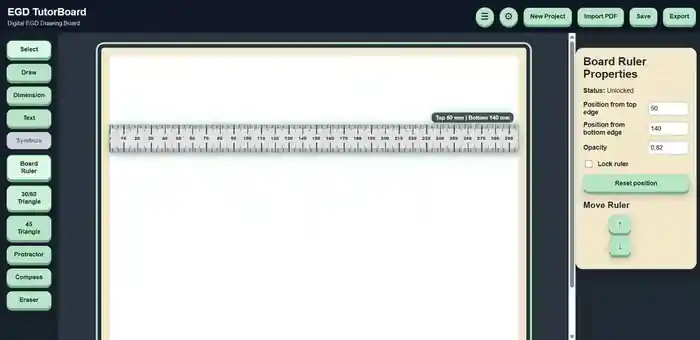
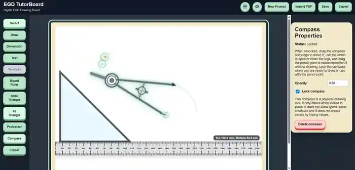
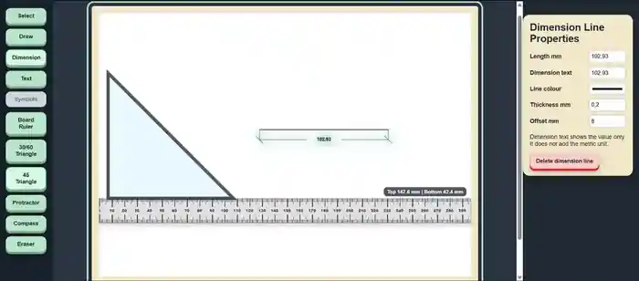
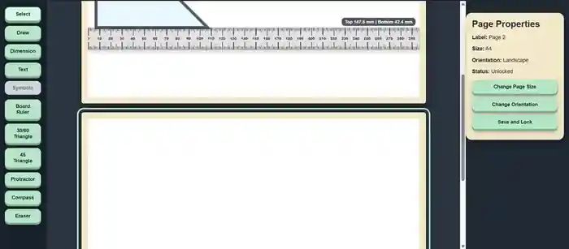
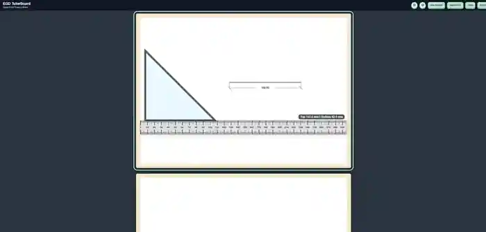

# EGD TutorBoard

**Status:** In development — advanced working prototype

EGD TutorBoard is a specialised digital drawing-board application for Engineering Graphics and Design (EGD) tutors and learners.

It was created because generic whiteboards and geometry tools did not provide the combination of accurate page sizes, millimetre-based measurements, realistic drawing instruments and multi-page workflow needed for practical EGD tutoring.

## Prototype preview

*Work-in-progress cover created inside TutorBoard itself using the app's drawing tools and physical-style EGD instruments.*

## The problem

Online EGD tutoring is difficult when the software behaves like a normal whiteboard instead of a technical drawing board. Tutors and learners need tools that support proper drawing technique, accurate measurements and realistic interaction with EGD instruments.

## The solution

EGD TutorBoard is being built to provide a purpose-built EGD workspace with real page sizes, editable drawing objects and digital versions of traditional drawing instruments.

The app is designed to support both teaching and practical drawing while still requiring the learner to use correct EGD technique.

## Current working features

- Multi-page drawing workspace
- A3/A4-style page workflow and page setup locking
- Per-page tool and drawing state
- Editable textboxes with movement and resizing
- Draw tool with EGD line types and line properties
- Millimetre-based editable drawing objects
- Full board ruler with top and bottom working edges
- Board ruler movement, locking, opacity and position control
- Drawing snap behaviour against the board ruler
- 30°/60° triangle with movement, rotation, flipping, locking and stencil behaviour
- 45° triangle with movement, rotation, flipping, locking and stencil behaviour
- Drawing along triangle edges
- 360° protractor with movement, rotation, locking and visual angle reading
- Physical-style compass with movement, locking and adjustable opening
- Compass arc drawing stored as editable millimetre-based objects
- Dimension Line tool with measurement, selection and snapping
- Whole Object Eraser
- Fine Eraser for drawn lines and compass arcs
- Global Ctrl+Z undo framework for supported actions
- Collapsible left toolbar and right Properties panel
- Automatic workspace enlargement when side panels are collapsed

## Working prototype gallery

### Board ruler

The board ruler can be moved, locked, repositioned from either page edge and adjusted for opacity.

### Triangle and ruler snapping

The 30°/60° and 45° triangles behave like physical drawing guides. They can be moved, rotated, flipped and locked, and can snap to the board ruler.

### Compass and editable arc drawing

The compass uses a physical-style pivot and pencil-leg interaction. When locked in place, it can draw arcs that are stored as editable drawing objects.

### Dimension lines

Dimension lines show measured length and expose properties such as dimension text, line colour, line thickness and offset.

### Multi-page drawing workspace

Projects can contain multiple drawing pages, with page size, orientation and lock state managed per page.

### Expanded workspace

The left toolbar and right Properties panel can be collapsed to give the drawing page more screen space while preserving the current work.

## A deliberate design decision

EGD TutorBoard is not intended to become an automatic geometry calculator.

Rulers and triangles are used as physical-style drawing guides and do not expose typed angle controls. The protractor remains the tool used to determine or check angles.

This keeps the software useful for learning while preserving the drawing technique the learner is expected to practise.

## Technical highlight

Drawing data is stored as editable objects rather than flattened images.

For example, the Fine Eraser does not simply paint white over a line or compass arc. It edits the underlying geometry and leaves the remaining pieces as editable drawing objects.

This approach supports future measurement, editing, selection, undo and export features.

## Technology

- React
- Vite
- TypeScript
- CSS
- SVG-based drawing and instrument rendering

## Current development stage

The core drawing-instrument system is already functional, but the project is still under active development.

### Planned / not yet complete

- Symbol Tool foundation
- Civil, architectural and electrical symbol libraries
- North arrow and projection symbols
- Lasso Delete
- PDF import and scale-to-page workflow
- Project save/open workflow
- PDF/image export
- Tutorial and revision content
- Final Microsoft Store packaging and release

## Project goal

The goal is to build a practical EGD-focused drawing environment that feels closer to using a real drawing board than a generic digital whiteboard, while making online tutoring and digital demonstrations easier.

---

**Project status:** Active development
